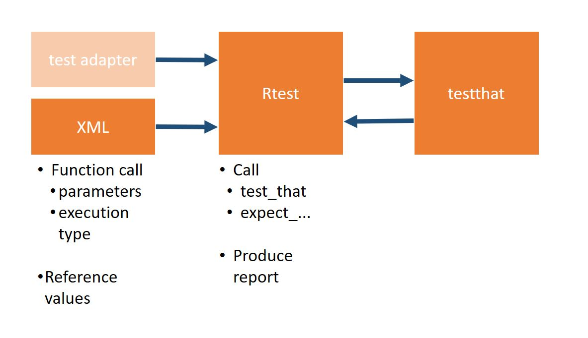
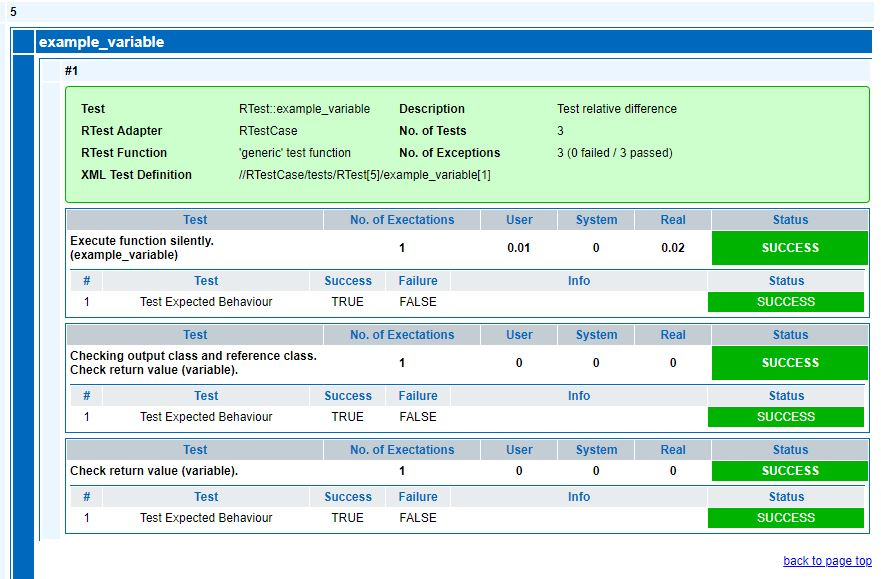

# RTest 

[](https://travis-ci.org/zappingseb/RTest)
[](https://codecov.io/gh/zappingseb/RTest)
[](https://cran.r-project.org/package=RTest)
[](https://cran.r-project.org/package=RTest)
[](https://github.com/zappingseb/RTest)

A XML-Based Testing Framework for Automated Component Tests of R Packages

This provides a framework for R packages developed for a regulatory environment. It is based on the 'testthat' unit testing system and provides the adapter functionalities for XML-based test case definition as well as for standardized reporting of the test results.

# Features #

**Main features**
* Human readible tests - `XML` based - [example](https://github.com/zappingseb/RTest/blob/master/xml-templates/RTest_TC-generic.xml)
* Human readible test reports - `html` websites [example](https://zappingseb.github.io/RTest/articles/RTest_TC-generic_result.html)
* High code coverage - [codecov](https://codecov.io/gh/zappingseb/RTest)

---
**Test types**
* Image comparison  - `html` websites [example](https://zappingseb.github.io/RTest/articles/RTest_TC-generic_result.html#TC-RTest_TC-generic-RTest_2-example_image)
* Data frame element wise comparison
* List element wise comparison
* Variables
* Vectors

---

**Test Report**
* Full package dependency logging in Test reports
* Full system environment logging in test reports

---

**For who?**

* Everybody working in a regulated field
* Everybody who has testers that cannot code
* Everybody that needs pretty test reports
* Everybody who wants to perform end-to-end tests

# Get Started #

```r
install.packages("RTest")

# For devel version
devtools::install_github("zappingseb/RTest")
```

There are two ways to start with RTest

:warning: **NOTE on reporting functionalities** :warning:

To derive more comprehensive reports from `testthat>2.0` you would have to overwrite the `testthat` function `as.expectation.logical` by:

```
assignInNamespace("as.expectation.logical", RTest::as.expectation.logical, ns="testthat", pos="package:testthat")
```

To avoid this unsafe call we created an issue at testthat: https://github.com/r-lib/testthat/issues/836

The difference between the `testthat` and the `RTest` version of the function lays in the message output. `testthat` just gives a message in case of failure, while
RTest always creates a message.

### 1 Vignettes

```
library(RTest)
vignette("RTest",package="RTest")
```

### 2 Work your way through a basic test setup

The easiest way to start with RTest is to clone this repository and especially the [`xml-templates`](https://github.com/zappingseb/RTest/tree/master/xml-templates) folder. There you can find some basic test cases that work without creating a test-adpater. See the figure below to know what this means:



So what RTest basically does, is allowing you to specify R-function calls and testthat calls inside XML files. Of course it
also executes the tests and hands back a pretty nice report.

A basic example of such an XML based test is [`RTest_TC-generic.xml`](https://github.com/zappingseb/RTest/blob/master/xml-templates/RTest_TC-generic.xml). It calls the functions

* example_data_frame 
* example_image 
* example_list
* example_vector 
* example_variable

that can be found in [`utils.examples.R`](https://github.com/zappingseb/RTest/blob/master/R/utils.examples.R). Each function
will create an object. `example_data_frame` an `data.frame`, `example_image` an ìmage, ... Inside the XML file you will see an example of testing the variable function as:

```xml
<example_variable test-desc="Test relative difference">
  <params>
    <x value="1" type="numeric" />
    <y value="1.2" type="numeric" />
  </params>
  <reference value="-0.2" type="numeric" />
  <testspec>
    <execution execution-type="silent" />
  </testspec>
</example_variable>
```

The R-Code of the function is:

```r
example_variable <- function(x=1.2,y=1){
	(x-y)/(x)
}
```

If you now run the following code inside your clone of this repo:

```r
RTest.execute("./xml-templates", f.pattern="RTest_TC-generic.xml")
```

an easy to read report will be generated. The full Test report can be found here: https://zappingseb.github.io/RTest/articles/RTest_TC-generic_result.html

But the major point is the variable report output which looks like this:



And that's the whole principle of RTest. You can generate human-readible tests and get human-readible reports by

* Generating XML test cases
* Running `RTest.execute`
* Reading the output `.html` report

